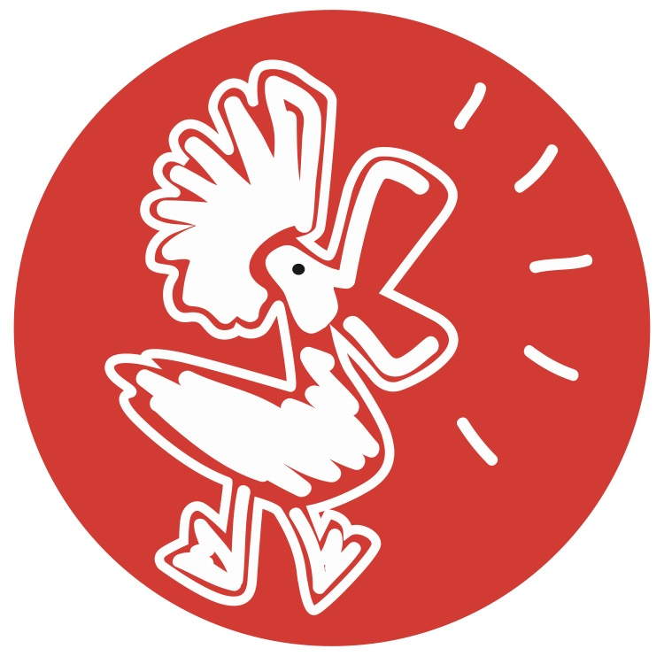

# Presentation Coach - AI-Powered Business Presentation Platform

[](https://reactjs.org/)
[](https://www.typescriptlang.org/)
[](https://vitejs.dev/)
[](https://supabase.io/)
[](https://openai.com/)
[](https://tailwindcss.com/)
[](LICENSE)

## Project Overview

Presentation Coach helps business owners create, practice, and perfect their business presentations by leveraging AI-generated scripts and advanced recording capabilities, solving the challenge of creating engaging video content while saving time and improving presentation quality.

<div align="center">
  
</div>

## Problem Statement

Small business owners struggle to create engaging video content that effectively communicates their brand story, often lacking the time, skills, or resources for professional video production. Current solutions like generic video templates or expensive production services don't address the need for personalized, authentic content. This results in missed opportunities for business growth and customer engagement, with businesses spending an average of 5-10 hours per week on content creation.

## ISBA Subfields

1. **Information Systems**
   - Custom-built web application using React and TypeScript
   - Integration with Supabase for secure data management
   - WebRTC implementation for video recording

2. **Business Analytics**
   - AI-powered script generation using OpenAI GPT-4
   - User behavior tracking and analytics
   - Performance metrics for video engagement

3. **Software Development**
   - Full-stack development with modern web technologies
   - Secure authentication and authorization
   - Cloud storage integration for video assets

## Solution Overview

### Technical Stack

#### Programming Languages
- TypeScript
- JavaScript
- SQL

#### Frameworks & Libraries
- React 18.3.1
- Vite 6.1.1
- TailwindCSS 3.4.1
- Framer Motion
- Zustand

#### Data Storage
- Supabase (PostgreSQL)
- Browser IndexedDB

#### APIs & Services
- OpenAI GPT-4
- Supabase Auth
- WebRTC

#### Hosting
- Netlify (Frontend)
- Supabase (Backend)

### Data Sources
- User business profiles
- AI-generated scripts
- Recorded video content
- User interaction metrics

## ✨ Core Features

### 🏢 Business Profile Management
- Detailed business questionnaire
- Industry-specific profiling
- Target audience analysis
- Business goals and objectives tracking
- Company background storage

### 🤖 AI Script Generation
- 60-second script generation using OpenAI GPT-4
- Context-aware content creation
- Industry-specific terminology
- Customizable tone and style
- Script version history and management
- Multiple script storage and retrieval

### 🎥 Professional Recording Studio
- Built-in teleprompter
- HD video recording
- Auto-scrolling script
- Word highlighting
- Recording pause/resume
- Multiple take management
- Video preview and download

### 🔐 User Authentication & Security
- Secure authentication via Supabase Auth
- Email/password authentication
- User profile management
- Session handling
- Row Level Security (RLS)
- Audit logging

## Next Steps / Future Improvements

1. **Enhanced AI Features**
   - Multi-language support
   - Voice tone analysis
   - Presentation feedback system

2. **Advanced Recording Features**
   - Background removal
   - Virtual backgrounds
   - Audio enhancement

3. **Analytics Dashboard**
   - Video performance metrics
   - Audience engagement tracking
   - A/B testing for scripts

4. **Collaboration Features**
   - Team workspaces
   - Shared script libraries
   - Feedback system

## Retrospective

### Challenges & Solutions

1. **Real-time Video Processing**
   - Challenge: Implementing smooth teleprompter scrolling with video recording
   - Solution: Custom WebRTC implementation with performance optimizations

2. **AI Integration**
   - Challenge: Generating contextually relevant scripts
   - Solution: Enhanced prompt engineering and business context integration

3. **Data Security**
   - Challenge: Secure video storage and sharing
   - Solution: Implemented Row Level Security and secure video URLs

### Learnings

1. Advanced WebRTC implementation
2. OpenAI API integration best practices
3. Supabase security patterns
4. React performance optimization
5. State management with Zustand

## 🛠️ Getting Started

### Prerequisites
- Node.js 18+ 
- Supabase account 
- OpenAI API key 
- npm or yarn 

### Installation

1. Clone the repository:
   ```bash
   git clone [repository-url]
   ```

2. Install dependencies:
   ```bash
   npm install
   ```

3. Configure environment variables:
   ```env
   VITE_SUPABASE_URL=your-supabase-url
   VITE_SUPABASE_ANON_KEY=your-supabase-anon-key
   VITE_OPENAI_API_KEY=your-openai-api-key
   ```

4. Start the development server:
   ```bash
   npm run dev
   ```

## References

- [Sprint Review Slides](https://docs.google.com/presentation/d/example)
- [Final Presentation](https://docs.google.com/presentation/d/example)
- [Project Documentation](https://docs.example.com/presentation-coach)

## 📄 License

This project is licensed under the Apache License 2.0 - see the [LICENSE](LICENSE) file for details.

## 🙏 Acknowledgments

- OpenAI for GPT-4 API 
- Supabase team for BaaS platform 
- React team for React 18 
- Tailwind CSS team 
- All contributors and users ❤️

